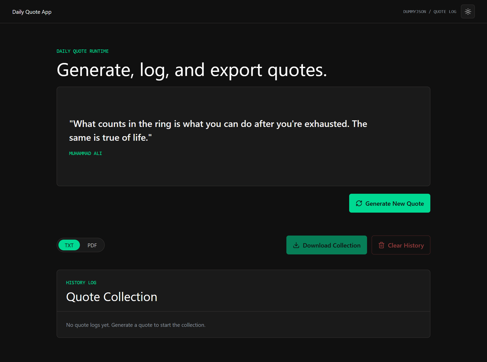

# Daily Quote App

A single-page quote generator with history, export, and theme switching. Fetch random quotes from an external API, save them locally, and download your collection as TXT or PDF.




## Live Demo

[](https://dailyquote.pyforgedev.web.id)

## Tech Stack

| Tool | Role |
|------|------|
| ⚛️ React 19 | UI rendering |
| ⚡ Vite 8 | Build tool and dev server |
| 🟨 JavaScript | Language (no TypeScript) |
| 🎨 CSS (custom properties, BEM) | Design system — no Tailwind |
| 💾 LocalStorage | Quote history and theme persistence |
| 📄 jsPDF | PDF export |
| 🖼️ lucide-react | Icons |
| 📊 @vercel/analytics | Analytics |
| ⏱️ @vercel/speed-insights | Performance insights |
| ▲ Vercel | Hosting and auto-deploy |

## ✨ Features

- **Random quote generation** — fetch from the DummyJSON quotes endpoint with shimmer skeleton loading while the request is in flight.
- **Quote history** — each generated quote is saved to localStorage under `daily-quote-history`. Delete individual entries or clear the entire list.
- **Export collection** — download the saved history as a plain-text file or a PDF (via jsPDF).
- **Theme switching** — light and dark modes, persisted in localStorage under `daily-quote-theme` (default: dark). Applied via `data-theme` on `<html>`.

## 🚀 Getting Started

Prerequisites: Node 20 or later (required by Vite 8).

```bash
git clone https://github.com/pyforgedev/daily-quote-app.git
cd daily-quote-app
npm install
```

### Scripts

| Command | Description |
|---------|-------------|
| `npm run dev` | Start dev server (binds `--host`) |
| `npm run lint` | Run ESLint on `.js` / `.jsx` files |
| `npm run build` | Produce production build in `dist/` |
| `npm run preview` | Preview the production build locally |

## 📁 Project Structure

```txt
src/
├── assets/
│   └── css/
│       └── global.css
├── components/
│   ├── ui/
│   │   ├── Button.jsx
│   │   ├── Card.jsx
│   │   ├── IconButton.jsx
│   │   └── TogglePill.jsx
│   ├── layout/
│   │   ├── Footer.jsx
│   │   ├── MainLayout.jsx
│   │   └── NavBar.jsx
│   └── features/
│       ├── quote/
│       │   ├── QuoteActions.jsx
│       │   └── QuoteHero.jsx
│       └── history/
│           ├── HistoryActions.jsx
│           ├── HistoryItem.jsx
│           └── HistoryList.jsx
├── context/
│   ├── ThemeContext.jsx
│   ├── theme.js
│   └── useTheme.js
├── hooks/
│   ├── useFetchQuote.js
│   └── useQuoteHistory.js
├── main.jsx
├── services/
│   └── api.js
└── utils/
    ├── exportPdf.js
    ├── exportTxt.js
    └── formatDate.js
```

## 🎨 Design System

The project uses a custom design system documented in [DESIGN.md](./DESIGN.md) (Indonesian).

Key design choices:

- **Fraunces** (serif) for quotes and headlines; **Space Grotesk** for UI text; **JetBrains Mono** for metadata
- Electric green (`#2fd6a1`) as the primary accent on a dark-first palette
- Ambient green glow and film grain overlay on the app shell
- Glass sticky navigation with `backdrop-filter: blur`
- CSS custom properties for all colors, radii, and motion tokens
- BEM-style class naming in `src/assets/css/global.css` — no Tailwind

## 🚢 Deployment

The app deploys automatically to Vercel on every push to `main`. The quote API (`https://dummyjson.com/quotes/random`) is a runtime dependency of the deployed app — the build does not embed or proxy it.

## 🤝 Contributing

1. Fork the repository
2. Create a feature branch
3. Commit your changes
4. Open a pull request

## 📄 License

MIT — see [LICENSE](./LICENSE).
